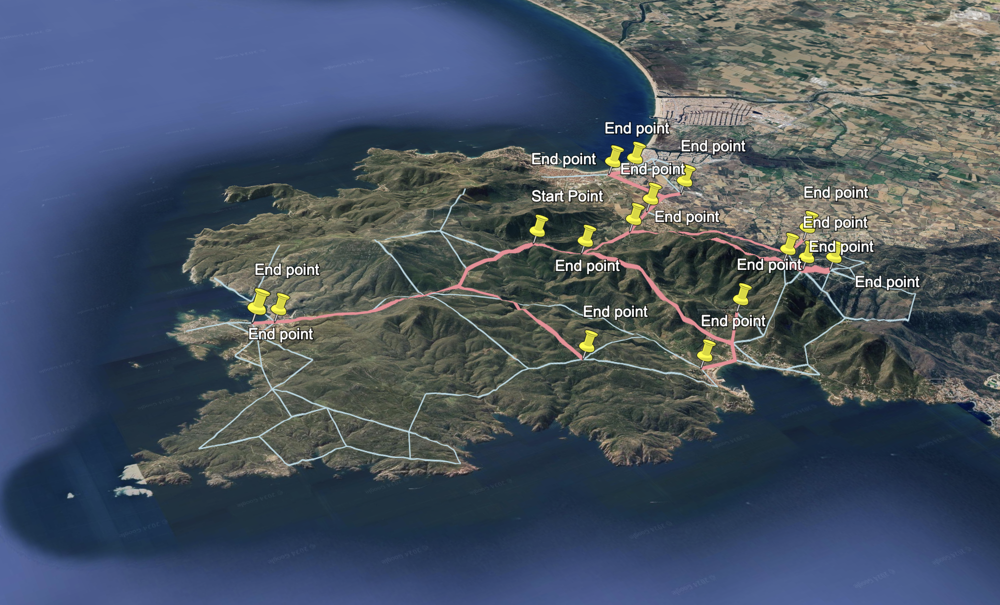
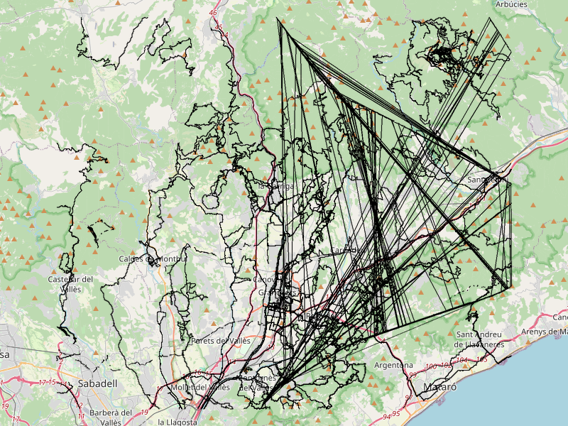
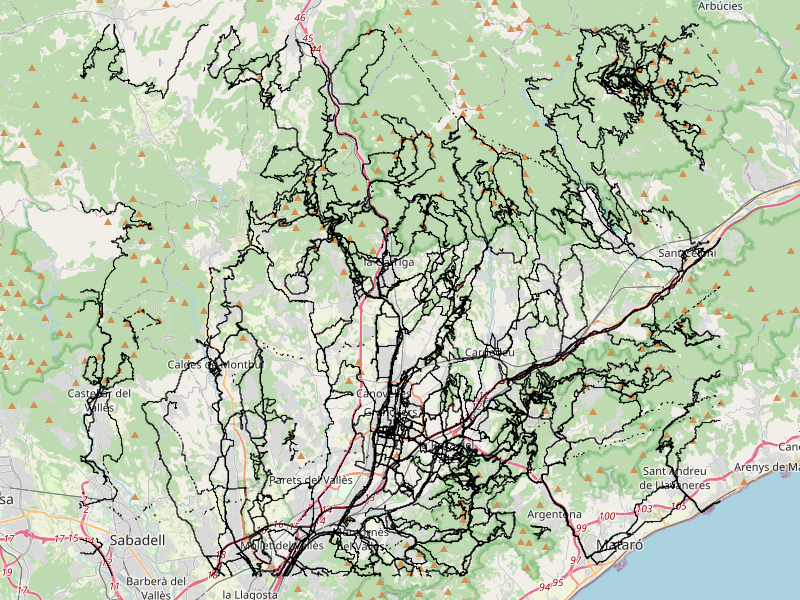

# Catalonia Connected 



With Catalonia Connected, you will be able to discover the delightful Catalonia landscape and natural beauty as well as its historical heritage. This app generates different maps of any given region in Catalonia which will guide you to nearby medieval monuments wherever you are. For doing this, we have modeled Catalonia as a graph, which allows us to search for optimum routes easily. In general traits, a graph is a set of points between some of which exist edges that connect them. We can model a territory as a graph in which nodes are relevant locations (monunments or intersections) and edges are paths connecting these locations. After executing, the program returns several maps, including a detailed map of the routes and paths, a view of the graph of your zone and a view of the locations of the monuments near you and the routes to reach them, as well as two .*kml files of that can be uploaded to Google Earth in order to see the maps in a 3d backround.


## Getting started

### Prerequisites
The requiered libraries to run the code are specified in the docuemt "requirements.txt" attached to this folder. To download them, simply execute the following command in your terminal window:

##### MacOs / Unix:
```
python -m pip install -r requirements.txt
```

##### Windows:
```
py -m pip install -r requirements.txt
```

### Installing the app
Once your system meets all the requirements to run the app, you can proceed to download the code. In this folder you will find several python files as well as some text documents. Download all the *.py files for the program to be executed correctly. Those are main.py, segments.py, monuments.py, graphmaker.py, routes.py, viewer.py and geographical.py. Additionally, you can also dowload segments.txt and monuments.txt, which contain data samples. You can open all the files using your default text editor.


## Running

#### Input parameters 

The program takes various input parameters:
- Coordinates (latitude and longitude) of the region you want. They must be the bottom-left-most and the top-right-most points
- File names for all the maps.
    - Segments data: file.txt where the geographical points will be stored.
    - Detailed map: file.png for the detailed routes map.
    - Monuments data: file.txt where the monuments data will be stored.
    - Simplified graph: *.png and *.kml files for the graph.
    - Routes map: *.png and *.kml for the routes map.
- The level of quality of the map can be adjusted by selecting the number oc clusters (nodes) and the mininmum angle between edges.

Please not that the program can download all the data when executing, but if you already have a downloaded data file there is no need to download it again. Type its name without the extension when the program asks you to. Monuments.txt contains all the data you will ever need about the monuments, but you will have to download a new segments data file each time you want to visit a new region. All the data files you download, as well as the maps, will be saved in your current directory, that is, the one you are running the program in. Don't name a new file with the name of an already existing file, as it might be replaced. All this information is specified again during execution.


### Testing
After installing the required libraries, you can run the code by executing only the main program in your terminal using the following command (make sure all the files are in your current directory):
```
pytohn3 main.py
```
You can use segments.txt and monuments.txt to run your first test. Use the coordinates "Delta de l'Ebre" from the sample file, then select 'all maps' option to get all the different maps. When asked for the segments and monuments data filenames, type 'segment_data' and 'monuments_data', respectively. Then, for the map files, select any name you want. The execution in your terminal should look like this:

```
Latitude of the lower left corner of your area: 40.5363713

Longitude of the lower left corner of your area: 0.5739316671 

Latitude of the upper rigt corner of your area: 40.79886535

Longitude of the lower left corner of your area: 0.9021482


What kind of maps do you need? Select a number and press return.
   0. Detailed map of OpenStreetMaps routes in your area.
   1. A simplified graph of all routes and paths in your area
   2. A graph showing the shortest routes from a certain location to the medieval monuments in your area
   3. All of them.

3

We will be making a graph to generate your maps.
Press 1 to adjust the level of detail you want in your graph.
Press 0 and the quality will be set with default values.

0

Where do you want to start the route? Enter coordinates below
Latitude of your starting point: 40.692481

Longitude of your starting point: 0.651148 

We will now ask you what you want to name the files we will generate for you. Please introduce filenames without their extension.
Please note:
-If you already have .txt files with the data you want to use to generate your maps, enter their names as well.
-Once you have a monument data file you can reuse it for any zone. This is NOT the same for segments!
-Be sure not to name the segment files for two different areas the same!
-For maps containing the graph and monument routes, two files will be generated: a 2D .png file and a 3D .kml file, both with the same name

file with segment data from OpenStreetMaps: seg_data_EBRE

Simplified graph of all paths and routes in your area: graph_EBRE

file containing monument data: monument_data

Map with the shortest routes to monuments around you: routes_EBRE

Detailed map of OpenStreetMaps routes: paths_EBRE
```
Once it finnishes, you should see the three maps popping in your screen, as well as two KML files saved in your current directory.

Now you can try the download functions specifying different filenames for the monument and segment data, which will appear in your directory. You can also try modifyinng the default quality for the maps and test diferent number of clusters. For doing this, you can try some other coordinates from the sample file. Downoading the data can take up to several minutes depending on how many geographical points are found in the zone you have selected (they can go up to a few millions).

### Visualizing the maps
In order to view the maps in 3d, you have to visit [Google Earth](https://www.google.es/intl/es/earth/index.html?client=safari) and upload the files saved in your system. 


## Technincal aspects
One of the main objectives when doing this project has been to do it as efficient as possible, but at the same time making the code simple and taking profit of python's great library support. The most complex algorithmic part is done while building the graph and finding the routes.

### Data
The information dowloaded from OpenStreetMaps are pairs of geographical points which follow different GPS tracked routes of people who uploaded them, as well as the time that person passed through that point. Each pair of points forms a segment. Sometimes a GPS can fail and some segments end up storing wrong information (large distances, wrong dates, incorrect times...), which cause the map to be confusing and showing wrong routes, such as this one.



That's why we've set standards for which segments we accept as valid: a segment will not valid if the distance between its starting and end point is grater than 100m. It will also be classified as defective if the dates of both points do not coincide or if their times differ in more than 1 minute. This constants have been decided after several tests, and their purpose is to avoid routes crossing dangerous or unaccessible places. Also, the data is cleaned before save to avoid keeping unnecessary segments and to avoid having to clean them every time, so if you check the data_EBRE.txt you will see that only the geographical points are saved, not the time. Here's the same map after cleaning the data.




### Building the graph

#### Clustering
The graph is built using a clustering algorithm from the points obtained from the download, specifically, we are using K-means algorithm from the library scikit-learn. The number of clusters can be specified by the user, but takes the default value of 100.

#### Simplifying
The objective of showing the graph in a map is to give the user a general view of of the region and to complement the routes map. For a detailed view of the routes you can check the segments map. That is the reason why, similarly to what we have done with the data, the graph is cleaned and simplified after being built. We have seen that some edges can be removed without losing too much information. Without going into details, an node can be removed if it has less than three edges connected to it and if the edges form an angle smaller than a constant. This constant is set by default at 30 degrees, but it can be modified by the user through the input. Also, we have set a standard of minimum GPS tracks that must connect two points from the graph to prevent them from being connected only by a single segment that crossed through a single not-accessible path. This is a comparison between the not-simplified graph, and the cleaned one:


### Finding the routes
The routes to each monument are computed based on the distance between it and the starting point, and always the shortest route is shown in the map. The method being used to compute the shortest path is Djiktra's algorithm, which finds the shortest routes to every node in a weighted graph starting from a certain node. In this case, Djikstra works because the weights are the distances, which are always positive. However, note that we are only interested in those paths that lead to a node that contains a monument, which means that we have to execute Djikstra in the sub-graph with these target nodes.

It is worth to say that the locations of the monuments do not necessarely coincide with the exact location of the node they are in, specially in graphs with few cluesters. We have had to assign each monument to its closest node on the graph in order to find the shortest routes. To do this we have decided to use brute force and iterate over every node and every monument every time. Although it might sound too slow, we must take into account that the number of nodes, that is, the number of clusters, is usually small (default is 100) and the same for the number of monuments in a zone, which is even smaller, so, in the end, this process can be done quickly. The same happens for the starting point of the route.

There might be some cases in which there are no routes that go from the starting point to specific mounments in your zone because there is no data of GPS routes that connect both. In these situations, instead of artificially connecting them, we have decided to show a warning message telling that there is no route that goes from your location to that specific monument. The reason for this is that we did not want to create routes through potentially dangerous or unaccessible paths

### Error handling
During th execution, the app uses various external sources, either for downloading data or managing files in the user's system. That's why we have built a robust error and exception handling system that constantly checks for potential errors being caused by poor internet connection, problems during access to web pages or while searching in the filesystem. That way, we prevent the program from suddenly sopping and the user always know what failed in case something does.

#### Type errors
We have tried to minimize the number of type errors of our code, however, many of the python libraries used do not have types specified and they can give errors when being imported or used. The program works correctly although you may see errors reported when opening the code with a text editor. You can use mypy to chek the type errors of the whole code.
```
pip3 install mypy
mypy main.py
```


## Built with
The code was done entirely with python. The data of the geographical points data is downloaded from the web pages of [Open Street Map](https://www.openstreetmap.org/#map=6/40.007/-2.488) , and the monuments from [Catalunya Medieval](https://www.catalunyamedieval.es). The 3d support for the maps has been done with [Google Earth](https://www.google.es/intl/es/earth/index.html?client=safari).

## Authors
- Ona Siscart Noguer - App development
- Blai Hernández Carbajo - App development 


## License

Universitat Politècnica de Catalunya BarcelonaTech, 2024
